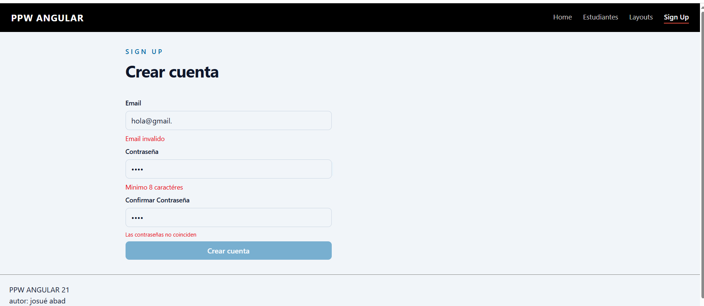
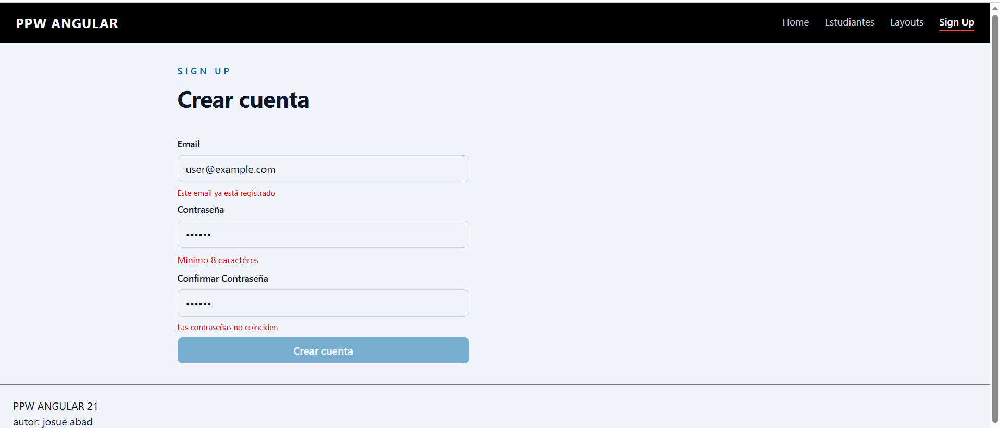

# Programación y Plataformas Web

# Frameworks Web: Angular 21 + TailwindCSS

## Practica 05 - Formularios Reactivos

### Autor
Josue Abad

---

## Descripción

En esta práctica se implementó un formulario reactivo en Angular utilizando validaciones síncronas, personalizadas y asíncronas.

El formulario corresponde a una página de registro (SignupPage) con control completo de estado mediante Reactive Forms.

## Tecnologías utilizadas
Angular 21
TypeScript
HTML
Reactive Forms (Angular)

## SignupPage - Formularios Reactivos
## Descripción

Se desarrolló un formulario reactivo con los siguientes campos:

Email
Password
Confirm Password

El objetivo es validar la información del usuario en tiempo real y controlar el estado del formulario desde TypeScript.

## Validaciones implementadas
Email requerido
Email con formato válido
Password mínimo de 8 caracteres
Confirmación de contraseña
Validación personalizada (password match)
Validación asíncrona de email único
Validación asíncrona de email

Se implementó un validador asíncrono que simula la verificación de un correo electrónico en una base de datos.

## Código del validador asíncrono
import {
  AbstractControl,
  AsyncValidatorFn,
  ValidationErrors,
} from '@angular/forms';
import { delay, map, Observable, of } from 'rxjs';

export function emailUniqueValidator(): AsyncValidatorFn {
  return (control: AbstractControl): Observable<ValidationErrors | null> => {

    if (!control.value) {
      return of(null);
    }

    return of(control.value).pipe(
      delay(500),

      map((email: string) => {
        const takenEmails = [
          'user@example.com',
          'admin@example.com',
          'test@example.com',
        ];

        return takenEmails.includes(email.toLowerCase())
          ? { emailTaken: true }
          : null;
      })
    );
  };
}
## Integración en FormGroup
email: [
  '',
  [Validators.required, Validators.email],
  [emailUniqueValidator()]
],
password: [
  '',
  [Validators.required, Validators.minLength(8)]
],
confirmPassword: [
  '',
  Validators.required
]

## Validación personalizada (password match)

Se utiliza un validador a nivel de formulario para verificar que las contraseñas coincidan.

{
  validators: passwordMatchValidator
}
Mensajes en el template
@if (email.status === 'PENDING') {
  
Verificando disponibilidad...

}

@if (email.touched && email.hasError('emailTaken')) {
  
Este email ya está registrado

}

@if (form.hasError('passwordMismatch') && confirmPassword.touched) {
  
Las contraseñas no coinciden

}

## Resultado final
Formulario reactivo con FormGroup
Validaciones síncronas (required, email, minLength)
Validación personalizada entre campos
Validación asíncrona simulando consulta a base de datos
Control de estado del formulario (VALID, INVALID, PENDING)
Feedback dinámico al usuario

