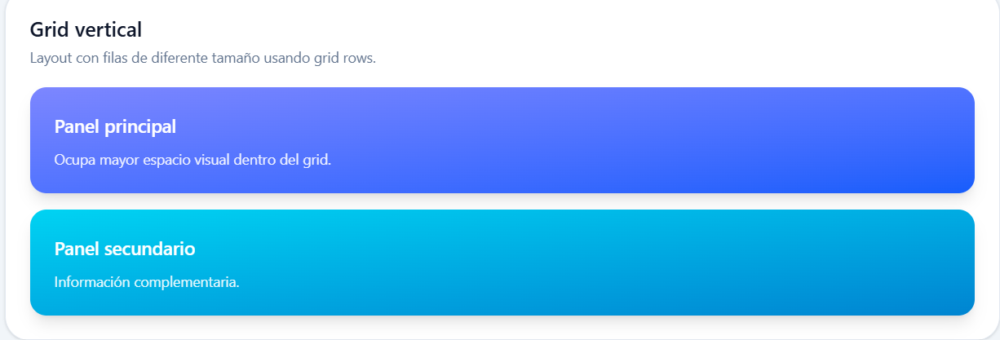
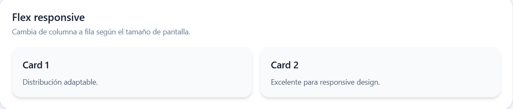
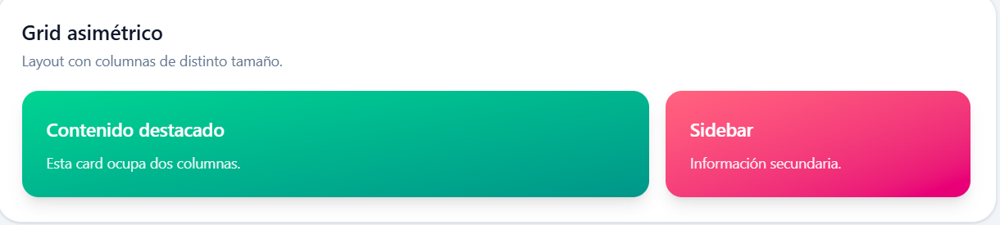
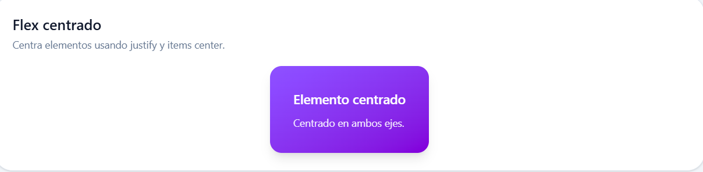

# Programación y Plataformas Web

# Frameworks Web: Angular 21 + TailwindCSS

## Practica 04 - Estilos y Layout con Tailwind

### Autor
Josue Abad

---

# Descripción

En esta práctica se aplicaron utilidades TailwindCSS sobre las páginas existentes del proyecto Angular:

- HomePage
- StudentsPage
- StudentDetailPage

Además, se creó una nueva página llamada `LayoutsPage` para explorar diferentes distribuciones usando Grid y Flexbox.

---

# Tecnologías utilizadas

- Angular 21
- TailwindCSS
- TypeScript
- HTML

---

# Cambios realizados

## HomePage

- Se reemplazaron estilos CSS por utilidades Tailwind.
- Se agregaron botones estilizados.
- Se aplicó spacing responsive.

---

## StudentsPage

- La lista de estudiantes fue convertida en cards.
- Se añadieron efectos hover y bordes con Tailwind.

---

## StudentDetailPage

- Se estilizó la caja del ID recibido.
- Se agregó un botón de retorno con efecto hover.

---

## LayoutsPage

Se implementaron diferentes distribuciones usando Grid y Flexbox:

- Grid de 4 columnas
- Grid con sidebar
- Grid de 3 columnas
- Flex carrusel horizontal
- Flex wrap

Además, se añadieron layouts personalizados adicionales.

---

# Layout adicional 1 - Grid Vertical

Este layout utiliza `grid-rows-2` para distribuir el contenido verticalmente.



---

# Layout adicional 2 - Flex Responsive

Este layout cambia automáticamente entre columna y fila dependiendo del tamaño de pantalla.



---

# Layout adicional 3 - Grid Asimétrico

Este layout utiliza `col-span` para destacar contenido principal dentro del grid.



---

# Layout adicional 4 - Flex Centrado

Este layout centra elementos horizontal y verticalmente usando Flexbox.



---

# Ejecución del proyecto

Instalar dependencias:

```bash
pnpm install